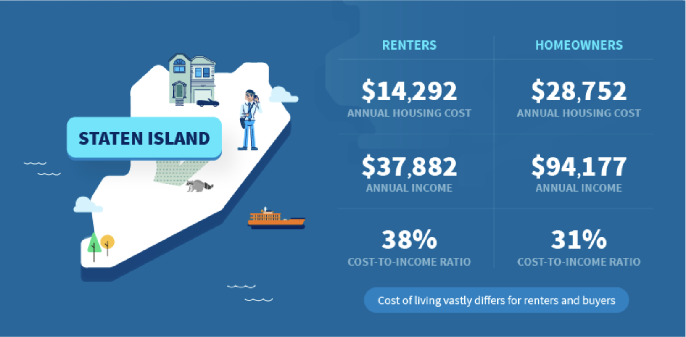

# Reusable Components with Props - Lab



## The Goal

StreetEasy is a site used to buy, sell, and rent apartments in New York City. StreetEasy also leverages both public and in house data to publish a blog about real estate trends in the city.

The problem is, they could be creating their blog posts much more efficiently. Instead of designing individual graphics as they do now (see example above), they could be using reusable components in React to quickly create, update and display data on their site. In this lab we are going to refactor a page from their blog using React - they'll thank us for this later.

## Getting Started

1. Create your own copy of this template repository with the "Use This Template" button.
2. Clone this repository down using `git clone`.
3. `cd` into your local copy of the repository.
4. `npm install`.
5. `npm start`.

Before jumping into this activity, check out the blog post we will be refactoring:
[Cost of Living in NYC](https://streeteasy.com/blog/cost-of-living-nyc-income-housing-all-5-boroughs/)

## The Lab

1. We are going to be begin by making the Staten Island graphic from the StreetEasy blog post. In the `App.jsx` component, find the `<DataView/>` component below the `<h2>` element. Add the following attributes to the `<DataView/>` component. This will pass down the provided information as props to the component.

```javascript
<DataView borough="Staten Island" renterCost="$14,292" ownerCost="$29,752" />
```

2. You'll notice the ownerCost prop isn't being displayed! Update the `DataView.jsx` file to render the ownerCost prop.

3. Add an additional `<DataView/>` component to the `App.jsx` for each of the boroughs (Queens, Brooklyn, Manhattan, Bronx). Fill in the props with the data provided in the StreetEasy blog post linked above.

4. We are going to add another row so we can display the annual income of both renters and owners in this component. Pass the additional props in as shown below, and then modify the JSX in the `DataView` function in `DataView.jsx` to display these new props. You'll need to add another row to the HTML table beneath the renter cost.

```javascript
<DataView
  borough="Staten Island"
  renterCost="$14,292"
  ownerCost="$29,752"
  renterIncome="$37,882"
  ownerIncome="$94,177"
/>
```

5. Add the `renterIncome` prop and `ownerIncome` prop to the `<DataView/>` components for the remaining four boroughs with the appropriate data.

6. Add another row to the `<DataView/>` component to display the "Cost-To-Income ratio" for each borough. You won't need to pass a new prop - this can be dynamically computed inside the `{}` that we use to display data. 
    * While it's not necessary, you may decide that you want to change the format you're using to pass in the props - the example code shows how to pass in strings (e.g. `renterCost="$14,292"`), but you could also decide to pass in a number instead (e.g. `renterCost={14292}`) and handle the [currency formatting](https://stackabuse.com/how-to-format-number-as-currency-string-in-javascript/) within the component.  

7. You'll notice that in the original blog post, there is a message at the bottom of each graphic. For example, in the Staten Island graphic it says "Cost of living vastly differs for renters and buyers." Add this piece of styling and text to the `DataView` component.

## Extensions

1. [Destructure the props](https://medium.com/@lcriswell/destructuring-props-in-react-b1c295005ce0) in the `DataView` component. If this is done correctly, it means that we will no longer need to use `{props.renterCost}` inside the return of our `DataView` component. We can instead use the more readable `{renterCost}`.

2. The current application uses the same image for all five boroughs. This could be more dynamic. Find a way to use the `borough` prop to display a unique image for each NYC borough. You can use a zoomed in copy of this map, a photo of a relevant landmark, or any other image that feels useful.

3. Right now there are a few CSS quirks that make this look a little strange on particularly large or small screens. There's one media query keeping things from being disastrous, but there are still quite a few things that could be improved. FIRST, comment out the existing media query in `DataView.css` and see how this application struggles on smaller screens. Then uncomment that media query and add any others that will be necessary to make this application more responsive on especially large or especially small screens.
